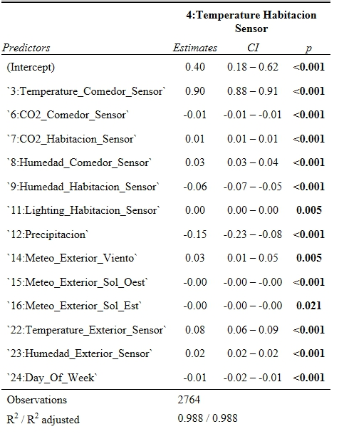
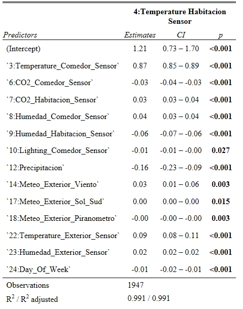

```{r setup, include=FALSE}
knitr::opts_chunk$set(echo = FALSE)
```

## Prezentacja danych

Zbiór zawiera dane pochodzące z pewnego domostwa w Hiszpanii zapisywane przez system monitorujący. Dane pobierane były co minutę, a następnie zostały wygładzone w 15 minutowych odstępach za pomocą średniej.

## Prezentacja danych

- Temperatura w pokoju oraz jadalni
- Prognozę temperatury na zewnętrz
- Zawartość CO2 (dwutlenku węgla) w pokoju oraz jadalni
- Względna wilgotność powietrza w pokoju oraz jadalni
- Natężenie oświetlenia
- Opady deszczu
- Prędkość wiatru
- Oświetlenie mieszkania
- Promieniowanie słoneczne
- Rzeczywista temperatura na zewnątrz
- Rzeczywista względna wilgotność powietrza
- Dzień tygodnia

```{r warning=FALSE, include=FALSE}
library(readr)
data_train <- read_table2("NEW-DATA-1.T15.txt")
data_test <- read_table2("NEW-DATA-2.T15.txt")
data_all <- rbind(data_train, data_test)
library(chron)
# laczymy date z godzina
data_all <- as.data.frame(data_all)
Date_time = chron(dates=data_all[,1],times=data_all[,2],format=c('d/m/y','h:m:s'))
data_all <- as.data.frame(data_all)
data_all[,25] <- Date_time
```

## Zmiany zawartości CO2 w powietrzu 26 marca
```{r}
plot(data_all[1240:1300,25],data_all[1240:1300,7], col = 'red', xlab = "Data", ylab = 'ppm')
points(data_all[1240:1300,25],data_all[1240:1300,6], col = 'blue')
legend('topleft', legend=c("Pokój", "Jadalnia"), col = c('red','blue'), pch = 21, cex=0.6)
```

## Zmiany zawartości CO2 w powietrzu 14 marca
```{r}
plot(data_all[80:120,25],data_all[80:120,7], col = 'red', xlab = "Data", ylab = 'ppm')
points(data_all[80:120,25],data_all[80:120,6], col = 'blue')
legend('topleft', legend=c("Pokój", "Jadalnia"), col = c('red','blue'), pch = 21, cex=0.6)
```

## Zmiany zawartości CO2 w powietrzu 21 marca
```{r}
plot(data_all[750:800,25],data_all[750:800,7], col = 'red', xlab = "Data", ylab = 'ppm')
points(data_all[750:800,25],data_all[750:800,6], col = 'blue')
legend('topleft', legend=c("Pokój", "Jadalnia"), col = c('red','blue'), pch = 21, cex=0.6)
```


```{r jadalnia, message=FALSE, warning=FALSE, include=FALSE, paged.print=FALSE}
#jadalnia temp
library(knitr)
data_jadalnia <- data_train[,c(3,4,6,7,8,9,10,11,12,14,15,16,17,18,22,23,24)]
model_3 <- lm(`3:Temperature_Comedor_Sensor`~ . - `12:Precipitacion` - `17:Meteo_Exterior_Sol_Sud`, data = data_jadalnia)
library(sjPlot)
library(sjmisc)
library(sjlabelled)
#tab_model(model_3)
odst_co2_j <- (211.2 - 200.9) * 1.5 + 211.2
data_train_1 <- data_train[data_train[,6] < odst_co2_j,]
odst_co2_p <- (212.8 - 202.4) * 1.5 + 212.8
data_train_1 <- data_train_1[data_train_1[,7] < odst_co2_p,]
odst_lux_j <- (26.69 - 11.52) * 1.5 + 26.69
data_train_1 <- data_train_1[data_train_1[,10] < odst_lux_j,]
odst_lux_p <- (23.42 - 13.18) * 1.5 + 23.42
data_train_1 <- data_train_1[data_train_1[,11] < odst_lux_p,]
data_jadalnia_1 <- data_train_1[,c(3,4,6,7,8,9,10,11,12,14,15,16,17,18,22,23,24)]
model_ob_7 <- lm(`3:Temperature_Comedor_Sensor`~ . - `10:Lighting_Comedor_Sensor` - `15:Meteo_Exterior_Sol_Oest` - `12:Precipitacion` - `16:Meteo_Exterior_Sol_Est` - `17:Meteo_Exterior_Sol_Sud` - `18:Meteo_Exterior_Piranometro`, data = data_jadalnia_1)

```


```{r pokoj, message=FALSE, warning=FALSE, include=FALSE, paged.print=FALSE}
data_pokoj <- data_train[,c(3,4,6,7,8,9,10,11,12,14,15,16,17,18,22,23,24)]
model_p <- lm(`4:Temperature_Habitacion_Sensor`~., data = data_pokoj)
model_p_1 <- lm(`4:Temperature_Habitacion_Sensor`~ . - `17:Meteo_Exterior_Sol_Sud`, data = data_pokoj)
model_p_2 <- lm(`4:Temperature_Habitacion_Sensor` ~ . - `17:Meteo_Exterior_Sol_Sud` - `18:Meteo_Exterior_Piranometro`, data = data_pokoj)
model_p_3 <- lm(`4:Temperature_Habitacion_Sensor` ~ . - `17:Meteo_Exterior_Sol_Sud` - `18:Meteo_Exterior_Piranometro` - `10:Lighting_Comedor_Sensor`, data = data_pokoj)
#tab_model(model_p_3)
data_pokoj_1 <- data_train_1[,c(3,4,6,7,8,9,10,11,12,14,15,16,17,18,22,23,24)]
model_p_ob_4 <- lm(`4:Temperature_Habitacion_Sensor`~ . - `16:Meteo_Exterior_Sol_Est` - `11:Lighting_Habitacion_Sensor` - `15:Meteo_Exterior_Sol_Oest`, data = data_pokoj_1)
```

```{r dwor, message=FALSE, warning=FALSE, include=FALSE, paged.print=FALSE}
data_dwor <- data_train[,c(3,4,6,7,8,9,10,11,12,14,15,16,17,18,22,23,24)]
model_d <- lm(`22:Temperature_Exterior_Sensor`~., data = data_dwor)
summary(model_d)
model_d_1 <- lm(`22:Temperature_Exterior_Sensor`~ . - `24:Day_Of_Week`, data = data_dwor)
summary(model_d_1)
model_d_2 <- lm(`22:Temperature_Exterior_Sensor` ~ . - `17:Meteo_Exterior_Sol_Sud` - `24:Day_Of_Week`, data = data_dwor)
tab_model(model_d_2)
```


## Model regresji wielorakiej dla temperatury w jadalni
```{r,echo=FALSE, out.width='.49\\linewidth', fig.width=3, fig.height=3,fig.show='hold',fig.align='center'}
knitr::include_graphics(c("Model_tabela_j.png", "Model_tabela_j_bez.jpg"))
#
#
```
## Wybór modelu dla jadalni
```{r, out.width='.49\\linewidth'}
library(Metrics)
x <- data.frame(predict(model_3,data_test),data_test)
rmse(x[,4], x[,1]) # 0.2094367
y <- data.frame(predict(model_ob_7,data_test),data_test)
rmse(y[,4], y[,1]) # 0.2377279
BIC(model_3, model_ob_7)
AIC(model_3, model_ob_7)
```

## Model regresji wielorakiej dla temperatury w pokoju
```{r,echo=FALSE, out.width='.49\\linewidth', fig.width=3, fig.height=3,fig.show='hold',fig.align='center'}
knitr::include_graphics(c("Model_tabela_p.jpg","Model_tabela_p_bez.jpg"))
```
## Wybór modelu dla pokoju
```{r, out.width='.49\\linewidth'}
library(Metrics)
data_test_3 <- data_test[,c(3,4,6,7,8,9,10,11,12,14,15,16,17,18,22,23,24)]
x1 <- data.frame(data_test_3,predict(model_p_3,data_test_3))
rmse(x1[,2], x1[,18]) # 0.1706739
y1 <- data.frame(predict(model_p_ob_4,data_test),data_test)
rmse(y1[,4], y1[,1]) # 0.5654549
BIC(model_p_3, model_p_ob_4)
AIC(model_p_3, model_p_ob_4)
```
