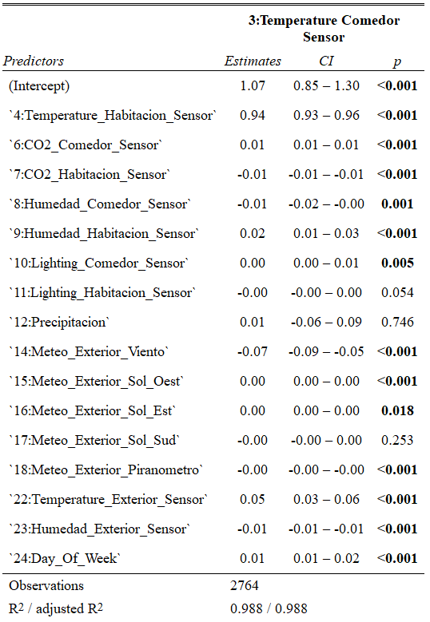

```{r setup, include=FALSE}
knitr::opts_chunk$set(echo = FALSE)
```

## Prezentacja danych

Zbiór zawiera dane pochodzące z pewnego domostwa w Hiszpanii zapisywane przez system monitorujący. Dane pobierane były co minutę, a następnie zostały wygładzone w 15 minutowych odstępach za pomocą średniej.

## Prezentacja danych

- Temperatura w pokoju oraz jadalni
- Prognozę temperatury na zewnętrz
- Zawartość CO2 (dwutlenku węgla) w pokoju oraz jadalni
- Względna wilgotność powietrza w pokoju oraz jadalni
- Natężenie oświetlenia
- Opady deszczu
- Prędkość wiatru
- Oświetlenie mieszkania
- Promieniowanie słoneczne
- Rzeczywista temperatura na zewnątrz
- Rzeczywista względna wilgotność powietrza
- Dzień tygodnia

```{r warning=FALSE, include=FALSE}
library(readr)
data_train <- read_table2("NEW-DATA-1.T15.txt")
data_test <- read_table2("NEW-DATA-2.T15.txt")
data_all <- rbind(data_train, data_test)
library(chron)
# laczymy date z godzina
data_all <- as.data.frame(data_all)
Date_time = chron(dates=data_all[,1],times=data_all[,2],format=c('d/m/y','h:m:s'))
data_all <- as.data.frame(data_all)
data_all[,25] <- Date_time
```

## 

```{r data_all}
plot(data_all[,25],data_all[,22], col = 'green', xlab = "Data", ylab = 'Stopnie Celsjusza', main = 'Temperatura')
points(data_all[,25],data_all[,3], col = 'blue')
points(data_all[,25],data_all[,4], col = 'red')
legend('topleft', legend=c("Pokoj", "Jadalnia", "Poza domem"), col = c('red','blue', 'green'), pch = 21, cex=0.45)
```

##
```{r}
boxplot(data_all[,3], data_all[,4], data_all[,22], col = c('blue', 'red', 'green'), 
        names = c('Jadalnia','Pokój','Poza domem'), ylab = 'Stopnie Celsjusza', main = 'Temperatura')
```


##
```{r}
plot(data_all[,25],data_all[,7], col = 'red', xlab = "Data", ylab = 'ppm', main = 'Zawartość CO2')
points(data_all[,25],data_all[,6], col = 'blue')
legend('topleft', legend=c("Pokój", "Jadalnia"), col = c('red','blue'), pch = 21, cex=0.6)
```

##
```{r}
boxplot(data_all[,6], data_all[,7], col = c('blue', 'red'), 
        names = c('Jadalnia','Pokój'), ylab = 'ppm', main = 'Zawartość CO2')
```


##
```{r}
plot(data_all[1240:1300,25],data_all[1240:1300,7], col = 'red', xlab = "Data", ylab = 'ppm', main = 'Zawartość CO2')
points(data_all[1240:1300,25],data_all[1240:1300,6], col = 'blue')
legend('topleft', legend=c("Pokój", "Jadalnia"), col = c('red','blue'), pch = 21, cex=0.6)
```

##
```{r}
plot(data_all[80:120,25],data_all[80:120,7], col = 'red', xlab = "Data", ylab = 'ppm', main = 'Zawartość CO2')
points(data_all[80:120,25],data_all[80:120,6], col = 'blue')
legend('topleft', legend=c("Pokój", "Jadalnia"), col = c('red','blue'), pch = 21, cex=0.6)
```

##
```{r}
plot(data_all[750:800,25],data_all[750:800,7], col = 'red', xlab = "Data", ylab = 'ppm', main = 'Zawartość CO2')
points(data_all[750:800,25],data_all[750:800,6], col = 'blue')
legend('topleft', legend=c("Pokój", "Jadalnia"), col = c('red','blue'), pch = 21, cex=0.6)
```

##
```{r}
plot(data_all[,25],data_all[,23], col = 'green', xlab = "Data", ylab = '%', main = 'Wilgotność')
points(data_all[,25],data_all[,8], col = 'blue')
points(data_all[,25],data_all[,9], col = 'red')
legend('topleft', legend=c("Pokój", "Jadalnia", 'Poza domem'), col = c('red','blue', 'green'), pch = 21, cex=0.6)
```

##
```{r}
# boxploty wilgotności w pokoju, jadalni oraz poza domem 
boxplot(data_all[,8], data_all[,9], data_all[,23], col = c('blue', 'red', 'green'), 
        names = c('Jadalnia','Pokój','Poza domem'), ylab = '%', main = 'Wilgotność')
```

##
```{r}
plot(data_all[1:1000,25],data_all[1:1000,11], col = 'red', ylab = 'Lux', xlab='Data', main = 'Natężenie oświetlenia')
points(data_all[1:1000,25],data_all[1:1000,10], col = 'blue')
legend('topleft', legend=c("Pokój", "Jadalnia"), col = c('red','blue'), pch = 21, cex=0.6)
```

##
```{r}
boxplot(data_all[,10], data_all[,11], col = c('blue', 'red'), 
        names = c('Jadalnia','Pokój'), ylab = 'Lux', main = 'Natężenie')
```

##
```{r}
plot(data_all[1:1000,25],data_all[1:1000,14], col = 'green', xlab = "Data", ylab = 'm/s', main = 'Wiatr')
```

##
```{r}
hist(data_all[,14], xlab = "m/s", ylab = 'Częstość', main = 'Wiatr', col = "green")
```


```{r jadalnia, message=FALSE, warning=FALSE, include=FALSE, paged.print=FALSE}
library(knitr)
data_jadalnia <- data_train[,c(3,4,6,7,8,9,10,11,12,14,15,16,17,18,22,23,24)]
model_3 <- lm(`3:Temperature_Comedor_Sensor`~ . - `12:Precipitacion` - `17:Meteo_Exterior_Sol_Sud`, data = data_jadalnia)
library(sjPlot)
library(sjmisc)
library(sjlabelled)
tab_model(model_3)
```


```{r pokoj, message=FALSE, warning=FALSE, include=FALSE, paged.print=FALSE}
data_pokoj <- data_train[,c(3,4,6,7,8,9,10,11,12,14,15,16,17,18,22,23,24)]
model_p <- lm(`4:Temperature_Habitacion_Sensor`~., data = data_pokoj)
model_p_1 <- lm(`4:Temperature_Habitacion_Sensor`~ . - `17:Meteo_Exterior_Sol_Sud`, data = data_pokoj)
model_p_2 <- lm(`4:Temperature_Habitacion_Sensor` ~ . - `17:Meteo_Exterior_Sol_Sud` - `18:Meteo_Exterior_Piranometro`, data = data_pokoj)
model_p_3 <- lm(`4:Temperature_Habitacion_Sensor` ~ . - `17:Meteo_Exterior_Sol_Sud` - `18:Meteo_Exterior_Piranometro` - `10:Lighting_Comedor_Sensor`, data = data_pokoj)
tab_model(model_p_3)
```

```{r dwor, message=FALSE, warning=FALSE, include=FALSE, paged.print=FALSE}
data_dwor <- data_train[,c(3,4,6,7,8,9,10,11,12,14,15,16,17,18,22,23,24)]
model_d <- lm(`22:Temperature_Exterior_Sensor`~., data = data_dwor)
summary(model_d)
model_d_1 <- lm(`22:Temperature_Exterior_Sensor`~ . - `24:Day_Of_Week`, data = data_dwor)
summary(model_d_1)
model_d_2 <- lm(`22:Temperature_Exterior_Sensor` ~ . - `17:Meteo_Exterior_Sol_Sud` - `24:Day_Of_Week`, data = data_dwor)
tab_model(model_d_2)
```


##
```{r}

```

